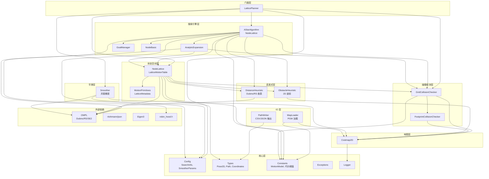
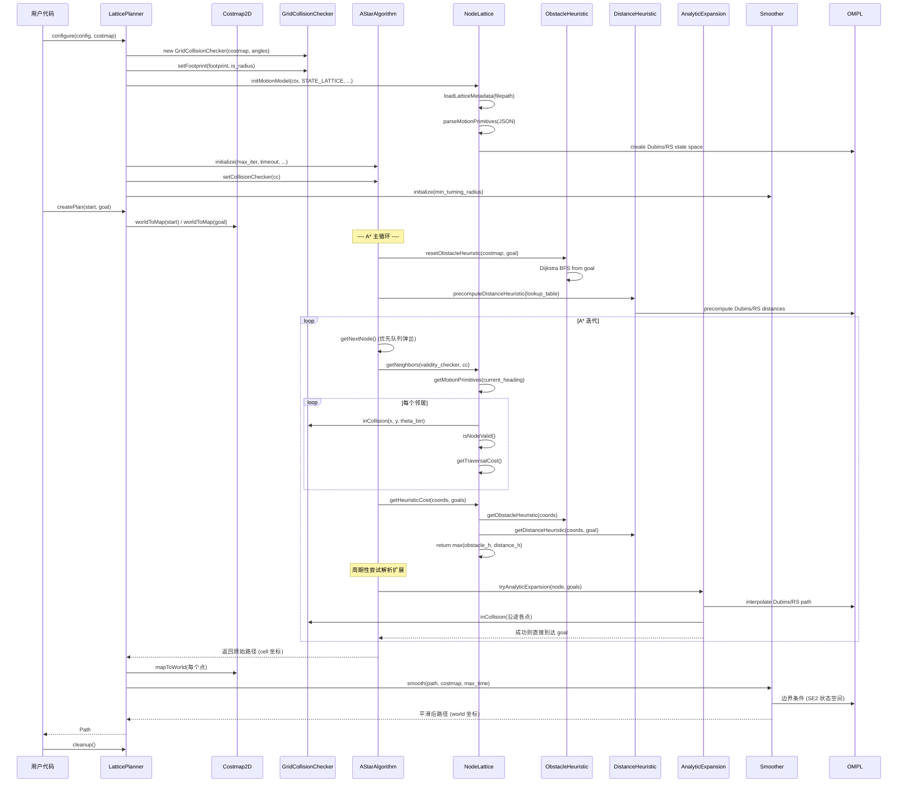

# 架构文档 — Standalone Lattice Planner

本文档描述独立 State Lattice 规划器的模块结构、数据流、算法原理与关键公式。
所有模块均已从 ROS 框架完全解耦，仅依赖标准 C++17、OMPL、Eigen3、nlohmann/json。

---

## 1. 目录结构

```
standalone_lattice_planner/
├── include/lattice_planner/         # 公共头文件
│   ├── core/                        # 核心类型、配置、常量、异常、日志
│   │   ├── types.hpp                # Point2D, Pose2D, Path, Coordinates
│   │   ├── config.hpp               # LatticePlannerConfig, SearchInfo, SmootherParams
│   │   ├── constants.hpp            # MotionModel, GoalHeadingMode, 代价阈值
│   │   ├── exceptions.hpp           # PlannerException 层次
│   │   └── logger.hpp               # LP_LOG_INFO/WARN/ERROR/DEBUG 宏
│   ├── costmap/costmap_2d.hpp       # Costmap2D 栅格地图
│   ├── collision/
│   │   ├── collision_checker.hpp    # GridCollisionChecker 碰撞检测
│   │   └── footprint_collision_checker.hpp  # 足迹碰撞基类
│   ├── state_space/
│   │   ├── motion_primitives.hpp    # MotionPrimitive, LatticeMetadata, JSON 解析
│   │   └── node_lattice.hpp         # NodeLattice, LatticeMotionTable
│   ├── heuristic/
│   │   ├── obstacle_heuristic.hpp   # 2D 障碍物波前启发式
│   │   └── distance_heuristic.hpp   # SE2 距离启发式 (Dubins/Reeds-Shepp)
│   ├── search/
│   │   ├── a_star.hpp               # AStarAlgorithm 模板类
│   │   ├── a_star_impl.hpp          # A* 实现 (header-only 模板)
│   │   ├── analytic_expansion.hpp   # 解析扩展 (Dubins/RS 曲线)
│   │   ├── analytic_expansion_impl.hpp
│   │   ├── goal_manager.hpp         # 目标管理器
│   │   └── node_basic.hpp           # NodeBasic 轻量队列元素
│   ├── smoother/smoother.hpp        # 共轭梯度路径平滑
│   ├── io/
│   │   ├── map_loader.hpp           # PGM 地图加载、测试地图生成
│   │   └── path_writer.hpp          # CSV/JSON/控制台路径输出
│   └── lattice_planner.hpp          # LatticePlanner 门面类
├── src/                             # 实现文件 (与 include 一一对应)
│   ├── costmap/costmap_2d.cpp
│   ├── collision/collision_checker.cpp
│   ├── state_space/node_lattice.cpp
│   ├── heuristic/obstacle_heuristic.cpp
│   ├── heuristic/distance_heuristic.cpp
│   ├── smoother/smoother.cpp
│   └── lattice_planner.cpp
├── examples/
│   ├── main.cpp                     # CLI 示例程序
│   └── data/
│       ├── default_config.json      # 默认配置
│       └── lattice/output.json      # Ackermann 运动基元 (72 方位)
├── test/                            # GoogleTest 单元测试
│   ├── CMakeLists.txt
│   ├── test_costmap.cpp
│   ├── test_collision_checker.cpp
│   ├── test_motion_primitives.cpp
│   ├── test_node_lattice.cpp
│   ├── test_a_star.cpp
│   └── test_smoother.cpp
├── thirdparty/robin_hood.h          # 高性能哈希表 (header-only)
├── scripts/generate_test_map.py     # 测试地图生成脚本
├── docs/                            # 文档
│   ├── API.md
│   ├── ARCHITECTURE.md              ← 本文件
│   └── PERFORMANCE.md
└── CMakeLists.txt                   # 构建系统
```

---

## 2. 模块依赖图



### 依赖原则

1. **单向依赖**: 上层依赖下层，下层不感知上层。`LatticePlanner` 是唯一对外的门面。
2. **核心层无依赖**: `core/` 目录下文件仅依赖标准库，可被任意模块包含。
3. **OMPL 隔离**: OMPL 仅出现在 `state_space/`、`heuristic/distance_heuristic`、`search/analytic_expansion`、`smoother` 四处，其余模块不直接依赖 OMPL。
4. **无 ROS 依赖**: 全部模块不包含任何 `rclcpp`、`nav2_*`、`geometry_msgs`、`tf2` 头文件。

---

## 3. 数据流图



---

## 4. 算法原理

### 4.1 State Lattice A* 总览

State Lattice 规划器在 SE(2) 状态空间 `[x, y, θ]` 上运行 A* 搜索。
与网格 A* 不同，节点的扩展不是简单的 8 邻域，而是沿**预计算的离散运动基元** (motion primitives) 进行，每个基元是一条满足车辆运动学约束 (最小转弯半径) 的短轨迹。

**核心思路**:
1. 将连续位姿空间离散化为 `(x_cell, y_cell, θ_bin)`，其中 `θ` 被量化为 72 个方位 (5° 间隔)。
2. 对每个起始方位，预计算一组运动基元 (直行、左转、右转等)，每条基元是结束位姿相对于起始位姿的偏移。
3. A* 搜索时，从当前节点出发，沿其方位对应的所有基元扩展邻居节点。
4. 代价函数综合考虑轨迹长度、转弯惩罚、代价值、反向惩罚。
5. 启发式使用 `max(2D 障碍物波前, SE2 距离)` 双启发式。
6. 周期性尝试 Dubins/Reeds-Shepp 解析扩展，若能直接连到目标则提前终止。

### 4.2 节点索引

节点在图中的唯一索引由三维坐标编码:

```
idx = θ + x * Nθ + y * Nθ * W
```

其中 `W` 是地图宽度 (cells)，`Nθ` 是方位量化数 (默认 72)。
`NodeLattice::getIndex(x, y, theta)` 和 `NodeLattice::getCoords(idx, W, Nθ)` 互为逆运算。

### 4.3 运动基元 (Motion Primitives)

运动基元从 JSON 文件加载 (默认 `examples/data/lattice/output.json`)，描述了 Ackermann 模型在给定参数下的离散轨迹集合。

**LatticeMetadata 关键字段**:

| 字段 | 含义 | 默认值 |
|------|------|--------|
| `min_turning_radius` | 最小转弯半径 (m) | 0.5 |
| `grid_resolution` | 栅格分辨率 (m) | 0.05 |
| `number_of_headings` | 方位量化数 | 72 |
| `heading_angles` | 各方位角度 (rad) | 72 个值 |
| `motion_model` | 运动模型名称 | "ackermann" |

**MotionPrimitive 结构**: 每条基元包含起始方位、结束方位、转弯半径、轨迹长度、弧长、直行长度、左/右转标志，以及一组 `MotionPose` (相对偏移轨迹点)。

**加载流程** (`LatticeMotionTable::initMotionModel`):
1. 读取 JSON 文件，解析 `lattice_metadata`。
2. 根据 `motion_model` 和 `allow_reverse_expansion` 创建 OMPL 状态空间:
   - OMNI → `SE2StateSpace`
   - 非 OMNI + 不允许反向 → `DubinsStateSpace(min_turning_radius)`
   - 非 OMNI + 允许反向 → `ReedsSheppStateSpace(min_turning_radius)`
3. 按 `start_angle` 分组，构建 `motion_primitives[heading_idx]` 二维数组。
4. 预计算 `trig_values` (cos, sin) 供碰撞检测使用。

### 4.4 代价函数

节点 `child` 的遍历代价 `g(child) = g(parent) + traversal_cost(parent, child)`:

```
normalized_cost = cell_cost(child) / 252.0
prim_length = transition_prim.trajectory_length / grid_resolution

if parent 无前驱 (prim == nullptr):
    return prim_length

if 轨迹长度 ≈ 0 (原地旋转):
    return rotation_penalty * (1 + cost_penalty * normalized_cost)

travel_cost_raw = prim_length * (travel_distance_reward + cost_penalty * normalized_cost)
                  // 二次型: cost_penalty * normalized_cost²  (可选)

if 直行:
    travel_cost = travel_cost_raw
elif 转弯方向不变:
    travel_cost = travel_cost_raw * non_straight_penalty
else (转弯方向改变):
    travel_cost = travel_cost_raw * (non_straight_penalty + change_penalty)

if 反向:
    travel_cost *= reverse_penalty

return travel_cost
```

其中:
- `travel_distance_reward = 1.0 - retrospective_penalty` (默认 0.985)
- `non_straight_penalty` (默认 1.05): 非直行惩罚
- `change_penalty` (默认 0.05): 转弯方向改变惩罚
- `reverse_penalty` (默认 2.0): 反向行驶惩罚
- `cost_penalty` (默认 2.0): 代价图惩罚
- `rotation_penalty` (默认 5.0): 原地旋转惩罚

### 4.5 双启发式

启发式取两个启发式的最大值，保证**可采纳性** (admissible):

```
h(node) = max(h_obstacle(node), h_distance(node))
```

#### 4.5.1 2D 障碍物波前启发式

从目标点在 2D 代价图上运行 **Dijkstra BFS**，考虑代价值:

```
h_obstacle(cell) = min over neighbors: h_obstacle(neighbor) + step_cost(neighbor → cell)
step_cost = 1 + cost_penalty * (cell_cost / 252)
```

支持 **2x 下采样** (`downsample_obstacle_heuristic`) 以加速大地图计算。
波前结果缓存，同一目标只需计算一次。

#### 4.5.2 SE2 距离启发式

使用 **Dubins 或 Reeds-Shepp 曲线** 预计算一个以目标为中心的窗口化查找表:

```
h_distance(node, goal) = Dubins/RS_distance(node, goal)
```

查找表维度: `(2*lookup_table_size+1) × (2*lookup_table_size+1) × Nθ`
利用对称性将存储减半。
超出查找表窗口时回退到 OMPL 实时距离计算。

**双启发式取 max 的理由**: 障碍物启发式在有障碍物时更准确，SE2 距离启发式在开阔区域更准确。取最大值保证两者中的更紧估计，维持可采纳性。

### 4.6 解析扩展 (Analytic Expansion)

在 A* 搜索过程中，每隔 `terminal_checking_interval` 次迭代，尝试从当前节点用 **Dubins 或 Reeds-Shepp 曲线** 直接连接到目标:

1. 调用 `OMPL::stateSpace->distance(node, goal)` 判断是否在尝试范围内 (比例 `analytic_expansion_ratio`)。
2. 若在范围内，用 OMPL 插值生成解析路径。
3. 对路径上每个点进行碰撞检测。
4. 若无碰撞且代价低于阈值，直接返回该路径，跳过剩余 A* 搜索。

这大幅减少了开阔区域的搜索节点数，是性能关键优化。

### 4.7 碰撞检测

#### 4.7.1 栅格代价查询

`Costmap2D::getCost(mx, my)` 返回 0-255 的代价值:

| 代价范围 | 含义 |
|----------|------|
| 0 | FREE_COST (自由) |
| 1-252 | 膨胀衰减区 |
| 253 | INSCRIBED_COST (内切) |
| 254 | OCCUPIED_COST (占据) |
| 255 | UNKNOWN_COST (未知) |

#### 4.7.2 足迹碰撞检测

**圆形足迹** (`footprint_is_radius = true`): 仅检查中心点代价。

**多边形足迹**: 预计算 `Nθ` 个旋转角度的足迹多边形 (`oriented_footprints_`)，碰撞检测时:
1. 查询中心点代价，若 `center_cost < possible_collision_cost` 则直接判定无碰撞 (快速路径)。
2. 否则对足迹多边形的每个顶点查询代价，取最大值。

#### 4.7.3 膨胀代价模型 (nav2 兼容)

距障碍物距离 `d` 处的代价:

```
cost(d) = 252 * exp(-a * (d - inscribed_radius))
a = ln(252/253) / (inflation_radius - inscribed_radius)
```

当 `d < inscribed_radius` 时代价为 INSCRIBED_COST (253) 或 OCCUPIED_COST (254)。

### 4.8 坐标变换

**世界坐标 ↔ 栅格坐标** (cell-center 约定):

```
mx = (wx - origin_x) / resolution     // 向下取整
my = (wy - origin_y) / resolution

wx = origin_x + (mx + 0.5) * resolution   // cell 中心
wy = origin_y + (my + 0.5) * resolution
```

连续版本 `worldToMapContinuous` 返回浮点栅格坐标，供亚 cell 精度碰撞检测使用。

### 4.9 路径平滑

使用 **共轭梯度法 (Conjugate Gradient)** 平滑路径，优化目标:

```
E = w_data * Σ |x_i - x_i^data|²  +  w_smooth * Σ |x_{i-1} - 2*x_i + x_{i+1}|²
```

- `w_data`: 数据项权重 (保持原始路径形状)
- `w_smooth`: 平滑项权重 (最小化二阶差分)

**边界条件**: 起止点用 OMPL SE2 状态空间的 Dubins/RS 曲线扩展，确保平滑后路径满足运动学约束。

**精细化** (`do_refinement`): 多轮平滑，每轮重新初始化梯度。

---

## 5. 关键数据结构

### 5.1 NodeLattice

```cpp
class NodeLattice {
  NodeLattice * parent;              // 父节点 (搜索树)
  Coordinates pose;                  // (x, y, theta) 栅格坐标 + 方位 bin
  float _cell_cost;                  // 该 cell 的代价 (NaN=未计算)
  float _accumulated_cost;           // g 值 (从起点到此处), 默认 FLT_MAX
  uint64_t _index;                   // 唯一索引
  bool _was_visited;                 // 是否已扩展
  const MotionPrimitive * _motion_primitive;  // 到达此节点的基元
  bool _backwards;                   // 是否反向到达
  bool _is_node_valid;               // 缓存的有效性
  NodeContext * _ctx;                // 共享上下文 (motion_table, heuristics)
};
```

### 5.2 NodeContext (共享上下文)

```cpp
struct NodeContext {
  LatticeMotionTable motion_table;                    // 运动基元表
  std::unique_ptr<ObstacleHeuristic> obstacle_heuristic;
  std::unique_ptr<DistanceHeuristic<NodeLattice>> distance_heuristic;
};
```

由 `AStarAlgorithm` 持有 `shared_ptr<NodeContext>`，所有节点共享同一上下文，避免重复加载基元。

### 5.3 Graph (搜索图)

```cpp
using Graph = robin_hood::unordered_node_map<uint64_t, NodeLattice>;
```

使用 `robin_hood` 高性能哈希表 (header-only, 在 `thirdparty/` 中)，节点指针稳定 (node_map 保证插入不失效)。

---

## 6. 线程安全

- `LatticePlanner::createPlan()` 内部使用 `std::mutex` 保护，同一实例可被多线程并发调用 (串行执行)。
- `Costmap2D` 本身不是线程安全的，外部调用方需保证规划期间代价图不被修改。
- `AStarAlgorithm` 内部状态 (图、队列) 在每次 `createPath` 调用时重置。

---

## 7. 异常处理

异常层次 (`core/exceptions.hpp`):

```
PlannerException (基类)
├── StartOutsideMapBounds
├── GoalOutsideMapBounds
├── StartOccupied
├── NoValidPathCouldBeFound
├── PlannerTimedOut
└── PlannerCancelled
```

所有异常继承自 `PlannerException`，后者继承自 `std::exception`。
`LatticePlanner::createPlan()` 在不同失败场景抛出对应异常类型，便于调用方精细处理。

---

## 8. 与原 nav2_smac_planner 的对应关系

| nav2_smac_planner | standalone_lattice_planner | 说明 |
|---------------------|------------------------------|------|
| `SmacPlannerLatticeT<NodeLattice>` | `LatticePlanner` | 门面类，简化生命周期 |
| `nav2_smac_planner::NodeLattice` | `lattice_planner::NodeLattice` | 相同算法，移除 ROS 类型 |
| `GridCollisionChecker` | `GridCollisionChecker` | 移除 Costmap2DROS 依赖 |
| `nav2_costmap_2d::Costmap2D` | `Costmap2D` | 纯 C++ 实现，接口兼容 |
| `Smoother` / `SmootherParams` | `Smoother` / `SmootherParams` | 移除 rclcpp 日志 |
| `nav_msgs::msg::Path` | `Path` (vector<Pose2D>) | 纯 C++ 结构 |
| `geometry_msgs::msg::Pose2D` | `Pose2D` | 纯 C++ 结构 |
| ROS 参数声明 | `LatticePlannerConfig::loadFromFile` | JSON 配置文件 |
| `tf2` 四元数转换 | `yawToQuaternion` / `quaternionToYaw` | 内联工具函数 |
| `angles::shortest_angular_distance` | `shortestAngularDistance` | 内联工具函数 |
| `rclcpp::Logger` | `LP_LOG_*` 宏 | 流式日志，输出到 stderr |

**移除的 ROS 依赖**: `rclcpp`, `rclcpp_lifecycle`, `nav2_costmap_2d`, `nav2_core`, `nav2_util`, `geometry_msgs`, `nav_msgs`, `visualization_msgs`, `tf2`, `tf2_geometry_msgs`, `angles`。

**保留的外部依赖**: OMPL (Dubins/RS/SE2 状态空间), Eigen3 (OMPL 间接依赖), nlohmann/json (配置和基元加载), robin_hood.h (哈希表)。
